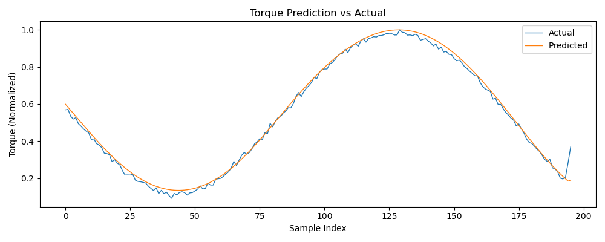
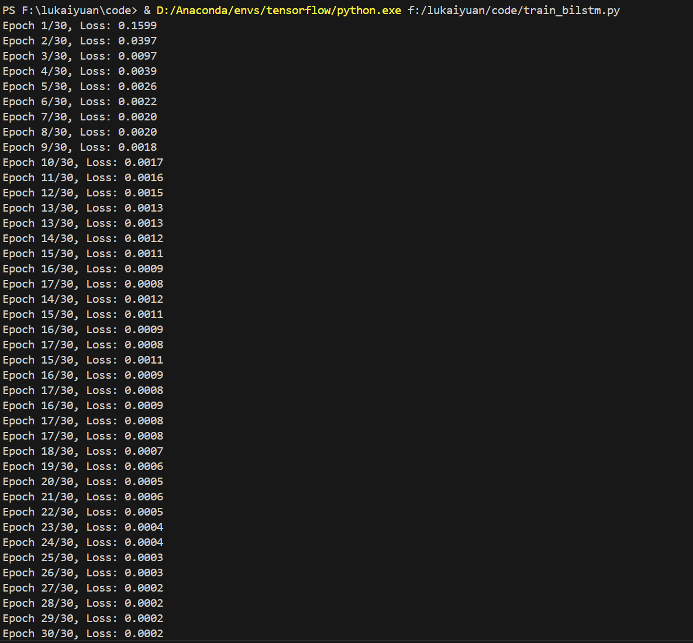

# 📋 凿岩机器人钻臂深度学习辨识研究  

---

## 一、本周主要工作内容

1. **搭建动力学仿真基础框架**
   - 使用 SolidWorks 建立钻臂三维模型，完成基础机构建模。
   - 确定采用 MSC Adams 作为仿真平台，进行动力学建模与仿真数据生成。

2. **明确研究方向与方法**
   - 根据文献综述，确定以“动力学参数辨识+深度学习误差补偿”为总体技术路线。
   - 计划采用 BiLSTM（双向长短时记忆网络）作为深度学习核心模型，实现力矩预测与辨识。

3. **仿真数据准备**
   - 钻臂关节数据（含角度、角速度、角加速度及力矩），用于后续神经网络训练。
   - 数据量：10秒，100Hz采样率，共1000组样本。

4. **建立深度学习初步模型**
   - 构建 BiLSTM 网络结构，完成数据归一化、滑动窗口切分等预处理工作。
   - 完成模型训练与预测，可实现较高精度的力矩预测，初步验证了深度学习方法的可行性。

---

## 二、已完成成果

- 完成仿真数据生成与预处理。
- 搭建 BiLSTM 网络并完成初步训练。
- 生成了预测 vs 实际扭矩变化曲线图，效果良好。
- 形成了初步的深度学习辨识流程，为后续真实仿真数据建模做好准备。

---

## 三、存在问题与下周计划

| 项目 | 说明 |
|-----|------|
| 存在问题 | SolidWorks导入Adams后动力学仿真数据还需扩展，部分仿真控制与数据导出流程待进一步学习和优化。 |
| 下周计划 | 深研钻臂模型在Adams中的仿真设置，输出更丰富的仿真数据；结合本周搭建的深度学习框架进行再训练，提高辨识精度。 |

---

## 四、使用教程
创建环境，我的：3.8.16（"tensorflow":conda）
```bash
pip install torch numpy pandas matplotlib scikit-learn
run train_bilstm.py
```
输出结果：

>预测曲线图 
>运行测试图 

---

